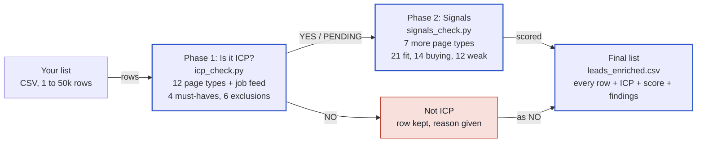
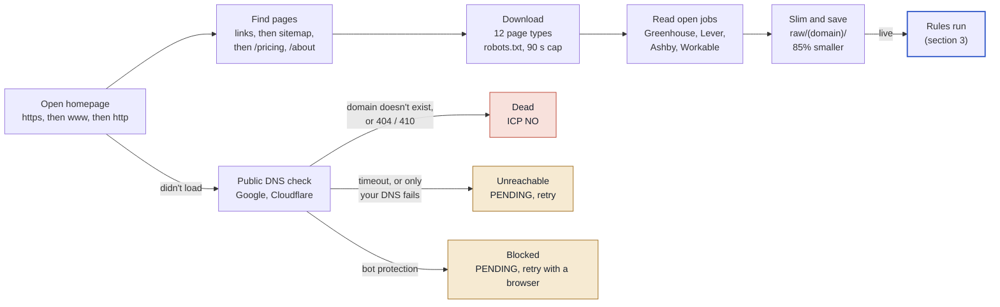
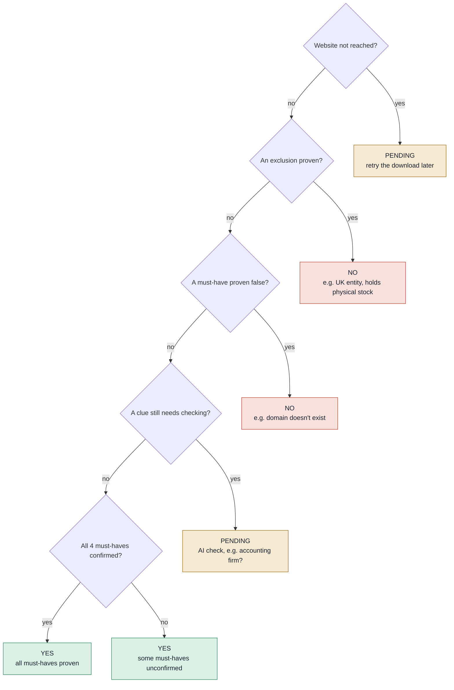
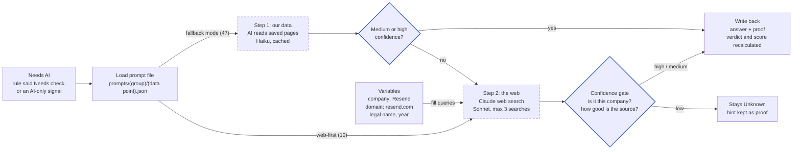
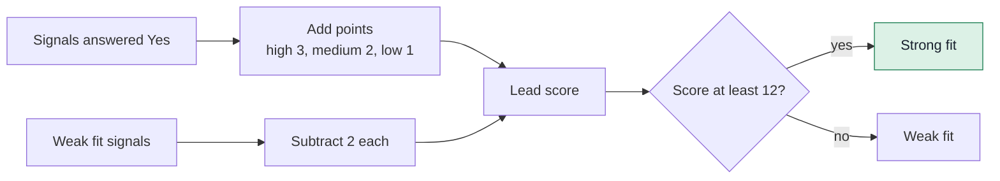
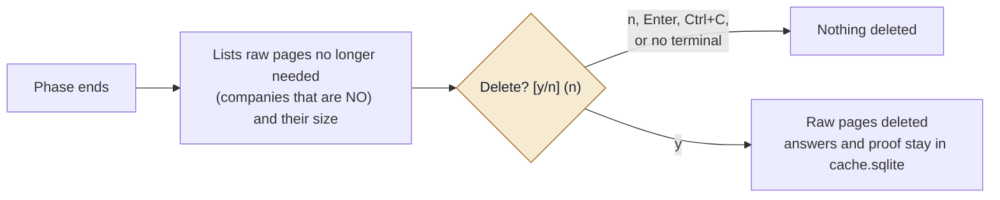

# ICP Pipeline Map

How a lead list moves through the two phases, from your CSV to a scored list where every original row is kept.

- **Solid boxes** are built and tested.
- **Dashed boxes** are designed and waiting on the AI step (needs an Anthropic API key).
- Colours: **green** = ICP YES, **red** = ICP NO, **amber** = PENDING.

```bash
.venv/bin/python icp_check.py leads.csv        # phase 1
.venv/bin/python signals_check.py leads        # phase 2
.venv/bin/python -m enrich explain acme.com    # every answer and its proof for one company
```

The diagrams use Mermaid. They render on GitHub and in VS Code with a Mermaid preview extension (for example "Markdown Preview Mermaid Support").

For more detail, see [HOW_IT_WORKS.md](HOW_IT_WORKS.md) (step by step), [SIGNALS.md](SIGNALS.md) (each check) and [PLAN.md](PLAN.md) (status and roadmap).

---

## 1. The whole flow

Phase 1 decides whether each company is our ICP. Only companies that pass go to phase 2, so no time or AI is spent on signals for companies we would never contact. Both phases feed the same final file.



Every row of your list ends up in the final file, in its original order. Duplicates are marked "Duplicate of row N". Rows without a usable domain are kept as NO with the reason.

---

## 2. Phase 1: downloading a website

About 50 companies run at the same time. Each one gets only the pages the must-haves and exclusions need, plus its open jobs. Pages are saved in a slim form, so rules can be re-run without downloading again.



A site is only marked dead when public DNS also says the domain doesn't exist. In testing, the local router failed on 4 of 14 real domains. Those now stay PENDING instead of being failed.

---

## 3. Phase 1: the ICP verdict

Free pattern-matching rules answer each must-have and exclusion with **Yes**, **No**, **Needs check** or **Unknown**, each with a quote and page link as proof. The verdict is then decided top to bottom. The first "yes" wins.



"Unknown" never makes a company a NO; only proof does. A company that is still unconfirmed on some must-haves is a YES, as profile.yaml requires.

---

## 4. AI: two steps per data point

Each data point the rules can't settle has its own prompt file in `prompts/`. Step 1 asks AI to read our saved pages. Only if that finds nothing does step 2 search the internet, with the company's details filled into the prompt's search queries.



| Variable | Filled with | Example |
|---|---|---|
| `{company}` | Company name from your list | Resend |
| `{domain}` | Cleaned domain from your list | resend.com |
| `{legal_name}` | Legal name found in phase 1, else the company name | Resend |
| `{year}`, `{last_year}` | Current and previous year | 2026, 2025 |

Example query for "Venture-backed": `"Resend" raises seed OR "Series A" OR "Series B"`.

| Web search mode | When step 2 runs | Data points |
|---|---|---|
| Fallback | Only if step 1 found nothing or only low confidence | 47 |
| Web-first | Always; step 1 is skipped | 10 (e.g. raised in the last 6 months, new board member) |
| Off | Never; the web can't prove it | 5 (e.g. live website, no finance person visible) |

| Confidence | Means | Counts? |
|---|---|---|
| High | Official record, the company's own page, or 2+ good sources, and a source mentions the domain | Yes, including making a company NO |
| Medium | One reputable source, with a domain or name-and-location match | Yes, but can't make a company NO |
| Low | Name-only match, SEO page, old information, or sources disagree | No; stays Unknown |

---

## 5. Phase 2: the lead score

Each signal answered Yes adds points by its weight in profile.yaml. Needs check and Unknown add nothing.

| Weight | Points |
|---|---|
| High | +3 |
| Medium | +2 |
| Low | +1 |
| Weak fit signal | -2 |



The two real scores from the 14-company test:

| Company | Score | Tier | Breakdown |
|---|---|---|---|
| linear.app | **21** | Strong fit | Stripe +3, Delaware C-Corp +3, Paid pricing +3, Several open roles +2, Growth numbers +2, Remote-first +2, Early adopter +2, Hiring +2, Tax deadline +2 |
| resend.com | **15** | Strong fit | Venture-backed +3, Stripe +3, Paid pricing +3, YC +2, Remote-first +2, Tax deadline +2 |

```
linear.app  ███████████████████████████████████████████▏ 21
resend.com  ██████████████████████████████▏              15
            0          6          12         18         24
                                  ↑ Strong fit cut-off
```

Notes:
- Scores are lower than they will be: "Startup selling nationally" and "B2B SaaS" (3 points each) wait on the AI step.
- "Tax deadline" adds 2 to almost everyone near a filing deadline. You can set it to 0 in [scoring.json](scoring.json).
- The cut-off of 12 is provisional. It should be set from about 100 hand-labelled companies.

---

## 6. Where everything is saved

Every list gets its own folder, so lists never mix.

```
lists/leads/              # one folder per list
  input.csv               # copy of your list
  raw/<domain>/           # slim pages + jobs
    home.html.gz
    pricing.html.gz
    jobs.json.gz
  cache.sqlite            # answers + proof
  output/
    leads_enriched.csv    # the main file
    icp_check.csv         # phase 1 detail
    signals.csv           # phase 2 detail
    *_evidence.jsonl      # quote + link per answer
    *_ai_queue.jsonl      # prompts waiting for AI
```

Nothing is deleted without asking:


