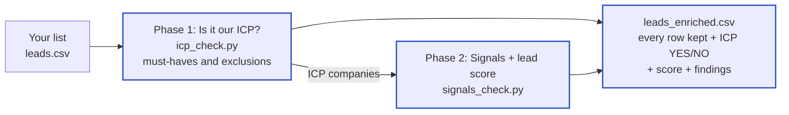

# PuzzleLeadScoring

Checks a lead list against Puzzle's ideal customer profile ([profile.yaml](config/profile.yaml)) and scores the companies that fit. Free Python scraping and pattern matching do most of the work; AI is only used for what's left.



| Doc | What it covers |
|---|---|
| **README.md** (this file) | Setup, commands, configuration, project files, status and roadmap |
| [PIPELINE.md](docs/PIPELINE.md) | How the pipeline works, step by step with diagrams: downloading, rules, verdict, AI, scoring, outputs, storage |
| [SIGNALS.md](docs/SIGNALS.md) | How each must-have, exclusion and signal is checked |

---

## Ground rules

These come from config/profile.yaml and shape everything else.

- **"We don't know" is not "no".** A company is never failed, excluded or marked down because something couldn't be found. Only proof counts.
- **Every answer comes with proof:** a short quote and the page it came from.
- **Cheap checks first.** Free scraping and rules run first; AI and web search only run for companies still in the running and questions still open.
- **Code does the scoring.** The same input always gives the same score, and changing a weight rescores everything in seconds without downloading again.
- **Your list is never trimmed.** Every original row stays in the final file, in order, with your original columns.

---

## Setup

```bash
python3 -m venv .venv
.venv/bin/pip install -r requirements.txt
```

Try it on the 14-company test list:

```bash
.venv/bin/python icp_check.py examples/sample_leads.csv
.venv/bin/python signals_check.py sample_leads
```

Your CSV needs a domain or website column. A company name and employee count column are used if present (common names like "Domain", "Website", "Company Name", "Employee Size" are recognised).

---

## Commands

```bash
# PHASE 1: is it our ICP? Must-haves and exclusions, for every company
.venv/bin/python icp_check.py leads.csv                 # same as: python -m enrich icp leads.csv

# PHASE 2: fit, buying and weak signals + lead score, only for companies phase 1 passed
.venv/bin/python signals_check.py leads                 # same as: python -m enrich signals leads
.venv/bin/python signals_check.py leads --only-yes      # skip companies still waiting on an AI check

# both phases, one after the other
.venv/bin/python -m enrich run leads.csv
```

| You want to | Run |
|---|---|
| See all lists: ICP yes / needs check / no, signals done, disk use | `python -m enrich lists` |
| See every answer and its proof for one company | `python -m enrich explain linear.app` |
| Re-check saved pages after changing a rule (no downloading) | `python -m enrich rules leads` (add `--phase icp` or `--phase signals`) |
| Continue a stopped run | Run the same command again; finished companies come from the cache |
| Delete raw pages no longer needed (always asks first) | `python -m enrich clean leads` |
| List the AI prompts | `python -m enrich prompts` |
| See the exact AI message for a company | `python -m enrich prompts --show fit/venture_backed_stage --domain resend.com` (add `--step 2` for the web search step) |

| Option | What it does |
|---|---|
| `--limit 100` | Phase 1: only the first 100 rows |
| `--list q4_leads` | Phase 1: choose the list folder name (default: the CSV name) |
| `--workers 100` | More companies at the same time (default 50) |
| `--refresh` | Download again, ignoring the cache |
| `--keep useful / none / all` | What the clean-up question offers to delete (see [PIPELINE.md](docs/PIPELINE.md#10-storage-and-clean-up)) |
| `--yes` | Delete without asking (only for scheduled runs) |

Results land in `lists/leads/output/`. The main file is **`leads_enriched.csv`**; [PIPELINE.md](docs/PIPELINE.md#9-outputs) lists every column.

---

## Tips before a big run

- **Use public DNS.** Some routers can't look up certain real domains (in testing, 4 of 14). The tool marks those "not reached, retry" instead of failing them, but they still won't be checked. Setting this Mac's DNS to 1.1.1.1 or 8.8.8.8 avoids it.
- **Pilot first.** Run 500 rows with `--limit 500` to see speed, block rate and the column mapping before the full list.
- **Check the scoring.** "Tax deadline coming up" adds 2 points to almost every company around April and October deadlines. Set it to `"none"` in config/scoring.json if you don't want that.

---

## Configuration

`config/profile.yaml` is written in sentences. It was turned into three things you can read and change:

| File | What it holds | Change it when |
|---|---|---|
| [enrich/rules.py](enrich/rules.py) | The pattern-matching rules: what counts as proof for each data point | A rule finds wrong answers or misses clear ones |
| [config/prompts/](config/prompts/) | One JSON prompt file per data point (62), plus shared rules and model names in `_shared.json` | AI should judge a data point differently |
| [config/scoring.json](config/scoring.json) | Points per signal (high 3, medium 2, low 1, weak fit -2), Strong fit cut-off (12), size bands | You want different weights or tiers |

After changing rules or scoring, run `python -m enrich rules leads` to update the results without downloading again.

---

## Project files

```
README.md             start here
icp_check.py          runs phase 1
signals_check.py      runs phase 2
requirements.txt
config/               everything you edit to change behaviour
  profile.yaml        the ICP definition (never changed by the tool)
  scoring.json        lead score weights, cut-off, size bands
  prompts/            one AI prompt per data point + _shared.json
docs/
  PIPELINE.md         how the pipeline works, with diagrams
  SIGNALS.md          how each data point is checked
examples/
  sample_leads.csv    14-company test list
enrich/
  __main__.py         all commands
  phase1_icp.py       phase 1: ICP check
  phase2_signals.py   phase 2: signals and score
  inputs.py           reads the CSV, cleans domains
  crawl.py            finds and downloads pages, job feeds, public DNS check
  rules.py            pattern-matching rules; which AI prompts each company needs
  prompts.py          loads prompt files and builds AI messages (both steps)
  scoring.py          lead score from scoring.json
  final.py            the final list: every original row + findings
  dashboard.py        live terminal view
  store.py, common.py storage and shared helpers
lists/<list>/         created per list: input.csv, raw/, cache.sqlite, output/  (not in git)
```

---

## Status and roadmap

### Built and tested (on a 14-company sample)

| Part | Status |
|---|---|
| Read any CSV, clean domains, keep every row | Done |
| Phase 1 and phase 2 as separate scripts | Done |
| Downloading pages, job feeds, robots.txt, public DNS check, slim saving | Done |
| Rules for all 4 must-haves, 6 exclusions and 37 signals | Done (accuracy checked on 14 companies only) |
| Final list with ICP YES / NO / PENDING, lead score, tier and segment | Done |
| 62 AI prompt files with a web search step | Written, not yet run |
| Live dashboards, `explain`, `lists`, `rules`, `clean`, ask before deleting | Done |
| Version control | Done: private GitHub repo `PuzzleLeadScoring` |

### Next, in order of impact

1. **Build the AI step** (needs an Anthropic API key). Step 1 reads our saved pages; step 2 searches the web only if step 1 found nothing. It settles every PENDING verdict and turns on the highest-weighted signals ("Startup selling nationally", "B2B SaaS"), so scores will rise.
2. **Group prompts at run time.** Keep one file per data point, but send 4 to 5 data points per AI call. Cuts AI cost about 3 to 4 times.
3. **Add free official directories:** SEC Form D (funding, date, state of incorporation), SEC public-company list (would have caught HubSpot), YC directory, IRS non-profit list.
4. **Hand-label about 100 companies** (ICP yes/no, Strong/Weak) to measure accuracy and set the Strong fit cut-off from data instead of the current 12.

### Then

5. **Real-browser fallback** (Playwright) for sites that block bots or need JavaScript (1 in 14 in the test).
6. **Follow investor and careers subdomains** such as `ir.hubspot.com`.
7. **Pilot on 500 real rows** to measure speed, block rate and cost.
8. **Run log** per list: date, settings, counts and cost of each run.
9. Optional: Clay (already connected) for headcount and funding on PENDING companies; monthly re-checks of old lists; a shared page for the team to browse results.

### Decisions and open questions

| Question | Status |
|---|---|
| AI models | Haiku 4.5 for reading pages, Sonnet 5.5 for web search and writing (in `config/prompts/_shared.json`) |
| Anthropic API key | **Needed** for the AI step |
| One AI call per data point, or grouped | Files stay one per data point; grouping per call is suggested, waiting on your OK |
| Undecided companies | PENDING until the AI check or a retry settles them |
| Weak fit points | -2 each (in config/scoring.json) |
| Strong fit cut-off | 12 for now; to be set after the 100-company check |
| Real lead list | A sample of 50 to 100 rows would help tune the rules |
| Old test folders | `data/`, `out/` and `lists/sample_leads/` are out of date; waiting on your OK to delete them |
