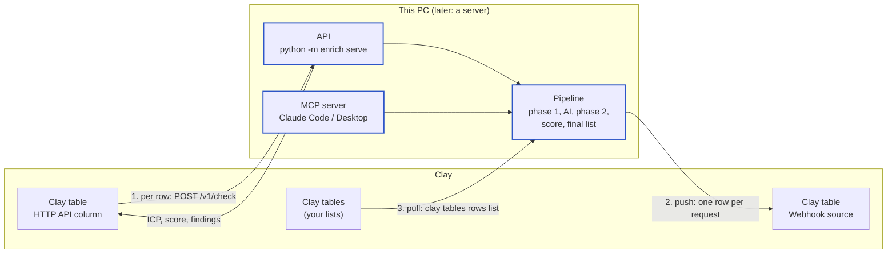

# Integrations: API, MCP and Clay

How other tools talk to the pipeline. Setup and the pipeline itself are in [README.md](../README.md) and [PIPELINE.md](PIPELINE.md).



| Flow | What happens | Needs |
|---|---|---|
| **1. Per row** | A Clay table calls our API for each company and fills columns with ICP YES/NO, score, tier and findings | Our API reachable from the internet (tunnel or server) |
| **2. Push** | After a list finishes, every row (all original columns + findings) is sent to a Clay table | A Clay table with a Webhook source |
| **3. Pull** | A Clay table is read as a new list and run through the pipeline; results can then be pushed back | `clay login` on this PC; the table needs a Domain or Website column |

---

## Set up once

All keys live in `.env` at the project root, each with a comment saying what it's for and where to get it. `.env` is readable only by you and never committed to git. `.env.example` is the blank copy in git, so teammates see which keys to fill in.

| Group | Key | Used for | Status |
|---|---|---|---|
| This project | `PUZZLE_API_KEY` | Key callers send to our API | Created automatically |
| AI | `OPENAI_API_KEY` | AI step (gpt-4o-mini) and its web search | Used |
| AI | `ANTHROPIC_API_KEY` | Claude as an alternative AI provider | Not used yet |
| Clay | `CLAY_WEBHOOK_URL` | Default Clay table to push results to | Used |
| Clay | `CLAY_WEBHOOK_TOKEN` | That webhook's auth token, if it has one | Used |
| Clay | `CLAY_API_KEY` | Clay Public API (pull and push work without it, through `clay login`) | Not used yet |
| Free directories | `SEC_CONTACT_EMAIL` | Contact email SEC EDGAR asks automated tools to send (YC, SEC and IRS need no key) | Optional |
| Other data tools | `CRUNCHBASE_API_KEY`, `APOLLO_API_KEY`, `PDL_API_KEY`, `SEARCH_API_KEY` | Funding, headcount, company data, a separate web search service | Planned |

Fill them in by editing `.env`, or from the terminal:

```bash
.venv/bin/python -m enrich settings                                   # every key and whether it's set
.venv/bin/python -m enrich settings --openai-key sk-...               # AI step
.venv/bin/python -m enrich settings --clay-webhook https://...        # default Clay table for pushes
.venv/bin/python -m enrich settings --clay-webhook-token ...          # only if that webhook has an auth token
.venv/bin/python -m enrich settings --clay-api-key ...                # Clay Public API (from `clay api-keys create`)
.venv/bin/python -m enrich settings --set APOLLO_API_KEY=...          # any other key
.venv/bin/python -m enrich settings --show-key                        # print the full API key for callers
.venv/bin/python -m enrich settings --rotate-api-key                  # replace the API key (callers need the new one)
```

The API key is created once and stays the same until you rotate it.

**Clay command-line tool:** installed at `~/.local/bin/clay` and signed in with `clay login`. Check with `clay whoami`. For Clay's own skills in Claude Code, type these two lines in the Claude Code chat:

```
/plugin marketplace add clay-run/agent-plugins
/plugin install clay@clay-plugins
```

---

## API

```bash
.venv/bin/python -m enrich serve                 # http://127.0.0.1:8787, this PC only
.venv/bin/python -m enrich serve --host 0.0.0.0  # reachable from your network
```

Interactive docs, where you can try every call: http://127.0.0.1:8787/docs

Every `/v1` call needs the key as a header: `x-api-key: <key>` (or `Authorization: Bearer <key>`). Wrong or missing key: `401`.

| Method and path | What it does |
|---|---|
| `GET /health` | Is the API up (no key needed) |
| `POST /v1/check` | One company, answered while you wait. Body: `{"domain": "acme.com", "company": "Acme", "employees": "12"}`. Options: `signals` (default true), `ai` (default false; costs money), `refresh`, `wait_seconds` (default 45) |
| `POST /v1/lists` | Start a whole list in the background. Body: `{"name": "q4", "rows": [{"Domain": "...", ...}], "push_to_clay": true}` |
| `POST /v1/lists/upload` | The same with a CSV file upload |
| `GET /v1/lists/{name}` | Progress: state, current step, ICP YES / NO / PENDING counts, push result |
| `GET /v1/lists/{name}/results` | Every row with all original columns + findings. `?format=csv`, `?only_icp=true`, `?limit=50` |
| `POST /v1/lists/{name}/push` | Send a finished list to a Clay webhook. Body: `{"only_icp": false}` and optionally `clay_webhook_url` |
| `GET /v1/clay/tables` | Tables in the signed-in Clay workspace |
| `POST /v1/clay/pull` | Read a Clay table and run it as a new list. Body: `{"table_id": "t_abc123", "push_to_clay": true}` |

**Speed:** a single `/v1/check` took about 5.5 seconds for a new company in testing, and is instant from the cache after that. If a check takes longer than `wait_seconds`, the answer is `"status": "still running"` and the check keeps going; calling again returns the result.

### Making the API reachable for Clay

Clay runs in the cloud, so it can't reach `127.0.0.1`. Two options:

| Option | How | Good for |
|---|---|---|
| Tunnel from this PC | `brew install cloudflared`, then `cloudflared tunnel --url http://localhost:8787`. It prints a public `https://...trycloudflare.com` address that forwards to the API while both are running. | Trying it out; the address changes each time |
| Server | Run `python -m enrich serve --host 0.0.0.0` on a server with HTTPS in front | Everyday use by the team |

Keep the API key secret in both cases: anyone with the address and the key can run checks.

### Clay HTTP API column (flow 1)

In the Clay table:

1. **Add column → HTTP API.**
2. Method `POST`, endpoint `https://<your public address>/v1/check`.
3. Header `x-api-key` = your API key.
4. Body (pick the table's columns where shown):
   ```json
   {"domain": "<Domain column>", "company": "<Company Name column>", "employees": "<Employee count column>"}
   ```
5. Map the response fields you want into columns: `ICP`, `ICP status`, `Why`, `Lead score`, `Lead tier`, `Segment`, `Fit signals found`, `Funding stage`, `Partners found`.
6. In the column's rate limit settings, start with about 5 requests per 10,000 ms. Clay's HTTP column has its own timeout; a slow answer shows as an `ETIME` error, so keep `wait_seconds` below it.

---

## Push to Clay (flow 2)

1. In Clay, create a table and add a **Webhook** source. Copy its URL (and its auth token, if you turn one on).
2. Save it once: `python -m enrich settings --clay-webhook <URL>` (plus `--clay-webhook-token <token>` if set).
3. Push a finished list:
   ```bash
   .venv/bin/python -m enrich push leads              # every row
   .venv/bin/python -m enrich push leads --only-icp   # only ICP = YES
   ```
   Or set `push_to_clay` when starting a list through the API or MCP.

Each row is one request, with all your original columns plus the findings (74 columns in testing). Rate limits and server errors are retried. Clay accepts up to 50,000 rows per webhook.

The token is sent as the `x-clay-webhook-auth` header. Check it against your webhook's settings in Clay on the first push.

---

## Pull from Clay (flow 3)

```bash
.venv/bin/python -m enrich pull                                # list the Clay tables in your workspace
.venv/bin/python -m enrich pull t_abc123 --list q4_clay         # read the table and run both phases
.venv/bin/python -m enrich pull t_abc123 --list q4_clay --push  # ...then push the results to the webhook
```

The table needs a column the pipeline recognises as the domain (Domain, Website, URL, Company Domain). For bulk enrichment tables, Clay only shows a sample of rows; the pull reports this as `truncated`.

---

## MCP server (Claude Code, Claude Desktop)

The project's `.mcp.json` registers it for Claude Code, so anyone who opens the project gets it. Claude Code asks once to approve it: run `claude` in the project folder, or open `/mcp`, and approve **puzzle-lead-scoring**.

| Tool | What it does |
|---|---|
| `check_company` | One company: ICP, score, tier, signals |
| `enrich_list` | Start a CSV file as a list in the background |
| `list_status` | Progress and counts of a list |
| `list_results` | Rows of a finished list (ICP = YES by default) |
| `explain_company` | Every answer with its proof |
| `clay_tables` | Tables in your Clay workspace |
| `pull_clay_table` | Read a Clay table and run it as a list |
| `push_list_to_clay` | Send a finished list to a Clay webhook |

For **Claude Desktop**, add this to its config file (`~/Library/Application Support/Claude/claude_desktop_config.json`), with your own project path:

```json
{
  "mcpServers": {
    "puzzle-lead-scoring": {
      "command": "/Users/<you>/path/to/PuzzleLeadScoring/.venv/bin/python",
      "args": ["-m", "enrich", "mcp"],
      "cwd": "/Users/<you>/path/to/PuzzleLeadScoring"
    }
  }
}
```

To run it on a server later, the same tools can be served over HTTP instead of stdio.
