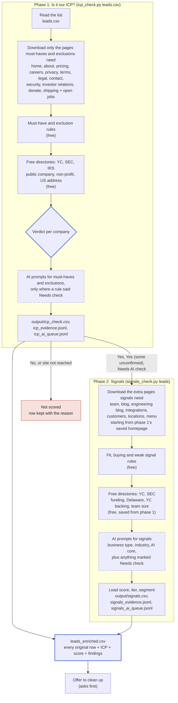
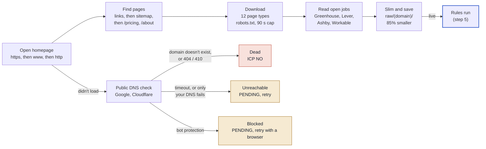
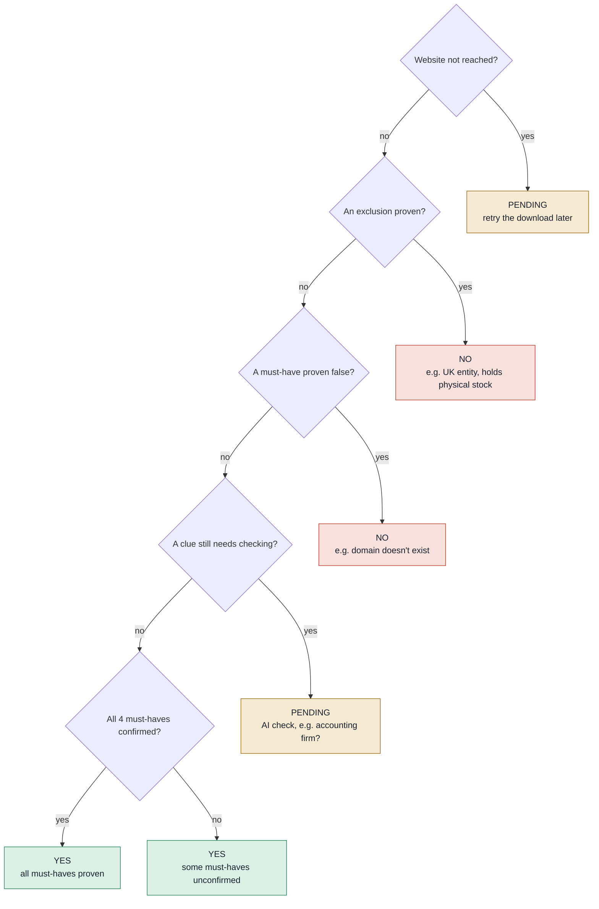
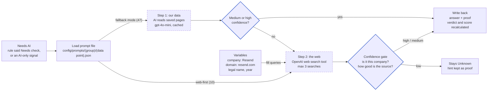
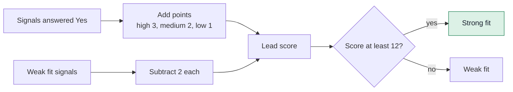
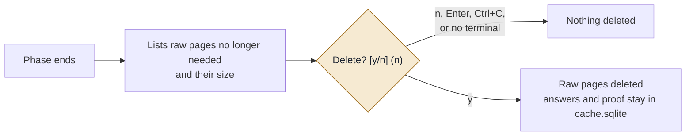
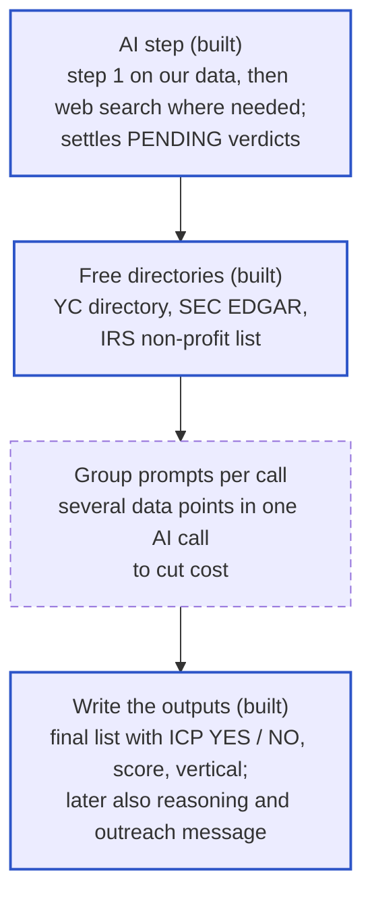

# How the Pipeline Works

Every step from your CSV to the scored list: what starts each step, what it decides, and what it hands to the next one.

- Setup, commands, configuration and roadmap: [README.md](../README.md)
- How each must-have, exclusion and signal is checked: [SIGNALS.md](SIGNALS.md)

**Reading the diagrams:** dashed boxes are the AI steps, which run separately with `ai_check.py` (OpenAI); everything else runs in the phase scripts. Green = ICP YES, red = ICP NO, amber = PENDING. Diagrams use Mermaid; they render on GitHub and in VS Code with a Mermaid preview extension.

---

## 1. The whole flow

The work runs in **two separate phases**, each with its own script. Phase 1 decides whether a company is our ICP. Phase 2 only runs on companies that passed, so no time or AI is spent on signals for companies we'd never contact.



|  | Phase 1: ICP check | Phase 2: signals |
| --- | --- | --- |
| Runs on | Every company in the list | Only companies that passed phase 1 |
| Pages downloaded | 12 page types needed for must-haves and exclusions | 7 more page types, added to phase 1's pages |
| Rules | 4 must-haves, 6 exclusions | 21 fit, 14 buying, 12 weak signals |
| AI prompts | Only where a must-have or exclusion needs a check | About 10 to 20 per company |
| In the 14-company test | 6 prompts in total | About 15 prompts per company |

Each phase works on about 50 companies at the same time. Every row of your list ends up in the final file, in its original order.

---

**To see every step for one company:** `python -m enrich trace acme.com` runs the whole flow for that company and stops after each step, showing what it received, found (with proof) and decided. `--ai` adds the AI steps (it shows the cost and asks first). The trace is saved as a Markdown report.

## 2. What starts what

| When this happens | It triggers |
| --- | --- |
| You run phase 1 (`icp_check.py leads.csv`) | Steps 3 to 10 for the whole list |
| You run phase 2 (`signals_check.py leads`) | Steps 4 to 10 for companies phase 1 passed |
| The list folder doesn't exist yet | A new folder `lists/leads/` and a copy of your CSV |
| A company was already downloaded in this list | Downloading is skipped; the saved pages are reused |
| You add `--refresh` | Downloading runs again, even for cached companies |
| The homepage loads | The search for the page types the phase needs |
| Important pages are missing from homepage links | A sitemap check |
| Phase 1 pages are still missing after the sitemap | Common addresses are tried (`/pricing`, `/about`, `/careers`, `/privacy`, `/terms`) |
| A downloaded page links to a page that's still missing | One more level of downloading |
| A page links to Greenhouse, Lever, Ashby or Workable | That job board's free public feed is read |
| The homepage doesn't load | Downloading stops for that company; public DNS decides its status |
| A rule finds a clue but can't be sure | "Needs check", and that data point's AI prompt is added |
| The rules finish for a company | The free directories are looked up (once per company, then saved in the list) |
| A directory settles a Needs check or Unknown | That data point's AI prompt is dropped, so it isn't paid for |
| The rules already made the company a NO | The SEC lookup is skipped (YC and IRS are local files, so they still run) |
| You add `--no-directories` | The directories are skipped for that run |
| Phase 1 verdict is No or site not reached | The company is left out of phase 2 |
| Phase 1 verdict is Needs AI check | Included in phase 2, unless you add `--only-yes` |
| Phase 1's pages for a company were deleted | Phase 2 downloads that company again from scratch |
| Every company in a phase is done | Outputs are written, then the clean-up offer |
| You answer **y** to the clean-up question | Raw pages of companies that aren't ICP are deleted |
| You answer anything else, or there's no terminal | Nothing is deleted |
| You change a rule and run `rules leads` | Rules run again on saved pages, without downloading |

---

## 3. Read the list

**Code:** [enrich/core/inputs.py](../enrich/core/inputs.py)

1. Finds the columns by name. Any of these work:
   - domain: Domain, Website, URL, Company Domain
   - name: Company Name, Company, Name
   - size: Employee Size, Employees, Headcount
2. Cleans every domain: `https://www.acme.com/about?x=1` becomes `acme.com`.
3. Checks each domain once. Duplicates and rows without a usable domain are still kept in the final list (see step 9).
4. Creates the list folder `lists/leads/` and copies your CSV into it as `input.csv`.

---

## 4. Download each website

**Code:** [enrich/sources/crawl.py](../enrich/sources/crawl.py) (`crawl` for phase 1, `crawl_more` for phase 2)

**Real-browser fallback:** when a homepage needs JavaScript to show its text, or shows a short "checking your browser" page, the site is read again with your installed Google Chrome (headless, at most 3 pages at a time), and every other page of that site is read the same way. Khan Academy went from 209 to 8,682 characters of text. Hard blocks (Cloudflare "Attention Required") usually stay blocked and are reported as such. `--no-browser` turns it off.

**DNS fallback:** when this computer's DNS can't find a real domain, the address comes from public DNS (Google, then Cloudflare), with the usual certificate checks.



**Site status.** A site is only marked dead when public DNS also says the domain doesn't exist. In testing, the local router failed on 4 of 14 real domains; those stay PENDING instead of being failed.

| Status | Meaning | Effect |
| --- | --- | --- |
| Live | Homepage loaded | Rules run |
| Dead | Domain doesn't exist (confirmed by public DNS), or 404 / 410 | ICP = NO (no live website) |
| Blocked | Bot protection (Cloudflare and similar) | PENDING, retry with a real browser |
| Unreachable | Timeout, other error, or only your network's DNS fails | PENDING, retry later |

**Pages it looks for.** Phase 1 downloads the first group; phase 2 adds the rest. Pages that turn out to be the homepage again, or "not found" pages, are thrown away. If the team, careers, privacy, terms, legal or security page is still missing, the links on already-downloaded pages are followed one level deeper.

| Page | Phase | Used for |
| --- | --- | --- |
| About, Pricing, Careers, Contact | 1 | Location, paid pricing, checkout, hiring, job board link |
| Privacy, Terms, Legal, Security | 1 | Legal name, state of incorporation, tools used (vendor lists) |
| Investor relations, Donate, Shipping | 1 | Possible public company, non-profit, physical stock |
| Team | 2 | Team members, finance people |
| Blog, Engineering blog, Customers | 2 | Growth numbers, funding news, early adopter signs |
| Integrations | 2 | Tools the product connects to (kept apart from tools the company uses) |
| Locations, Menu | 2 | Local or physical business |

**Open jobs.** If any page links to a known job board, its free public feed is read: Greenhouse, Lever, Ashby and Workable give every open role with title, location, remote flag and full description. Rippling is detected only (which also proves they use Rippling).

**Saving.** Each page is slimmed before saving (styles, inline scripts, icons and unused code removed; text, links, script addresses and structured data kept). Pages are about 85% smaller and give the same rule results.

**Politeness and speed.** Follows each site's `robots.txt`, skips files over 3 MB, gives each company at most 90 seconds, and keeps at most 200 requests in flight. Measured in the 14-company test: 11 to 16 requests per site in phase 1 and about 5 more in phase 2; about 30 seconds for the whole list.

---

## 5. Apply the rules

**Code:** [enrich/checks/rules.py](../enrich/checks/rules.py). **Cost:** nothing, it's pattern matching on saved pages.

Each check gives one of four answers. Every Yes and No is saved with a short quote and the page it came from.

| Answer | Meaning | Effect |
| --- | --- | --- |
| **Yes** | Proof found | Counts |
| **No** | Proof of the opposite found. Never a guess, and never "nothing found" | Counts |
| **Needs check** | A clue, but not certain, or two sources disagree | That data point's AI prompt is added |
| **Unknown** | Nothing found, or only a guess | Never counts against the company. Left **empty** in the output columns |

Yes and No are only given when confirmed. A clue that points one way but isn't proof (for example "Inc." with California law in the terms, which many Delaware companies use) is a Needs check, never a No.

The checks run in this order, because later checks use earlier answers:

| \# | Check | Looks at |
| --- | --- | --- |
| 1 | Website | Live, parked, "coming soon", needs JavaScript |
| 2 | Location and entity | US address, governing law, legal name, entity type |
| 3 | Pricing and sales | Prices, checkout, app store, waitlist |
| 4 | Tools | Stripe, Gusto, Rippling, Deel, Mercury, Brex, Ramp, Carta, Pulley, Chase, Wise; competitors such as QuickBooks, Xero, NetSuite |
| 5 | Jobs | Number of roles; finance, ops, bookkeeper roles; remote |
| 6 | Funding | Stage on own site, investors, stock ticker, YC, Techstars |
| 7 | Non-profit | 501(c)(3), donations, government domain |
| 8 | Physical stock | Store platform, stock labels, shipping, print-on-demand |
| 9 | Business type | Accounting firm clues, local business, opening hours |
| 10 | Other fit signals (phase 2) | Growth numbers, early adopter, holding company, tax deadline |
| 11 | Must-haves | Combines the answers above into the four must-haves |
| 12 | Weak signals (phase 2) | e.g. LLC with no funding found |

**How the rules avoid false matches:**

| Situation | What the rule does |
| --- | --- |
| "Connect your Stripe account" | Integration wording, so **Needs check**, not Yes |
| "The payment processors we work with are: Stripe" | Real usage, so **Yes** |
| "VibeGrade (YC X25)" in a customer story | Not the company's own backing, so ignored |
| A YC partner listed as an angel investor | **Needs check**, not Yes |
| "QuickBooks" in a job post | The company uses it, so **Yes** |
| "QuickBooks" on the integrations page | Probably an integration, so only noted as "mentioned" |
| "Series A, B and C" in one sentence | Not a confirmed early stage, so **Needs check** |
| "Inc." in the footer but no Delaware law, or another state's law | **Needs check** (could still be a Delaware company); SEC can confirm it |
| The site says the company is shutting down ("Pulley is shutting down on 12/8/26") | Live website with a real product: **No** (it's not an operating business going forward) |
| Funding found (investors, Form D, YC) but no early stage confirmed | The AI is asked "Series C or later, or public?" in phase 1, with web search if needed. Without this, late-stage private companies like Ramp passed |
| Only weak foreign clues (a .de domain, a foreign city, prices in euros) | **Needs check**. Outside the US only becomes proof with an official clue (foreign legal entity such as Ltd or GmbH, foreign governing law, or a foreign country in the site's structured data) plus another clue |

### Free directories: YC, SEC, IRS

**Code:** [enrich/sources/directories.py](../enrich/sources/directories.py). **Cost:** nothing; no account or key needed.

Right after the rules, every company is looked up in three free official sources. A directory answer fills what the rules left open (Needs check or Unknown). When a strong directory match **disagrees** with the website (say the site's clues point to the UK but the YC directory says San Francisco), neither wins: the answer becomes Needs check with both proofs, and the AI step decides. The company is not made a NO on contested evidence. One exception: an IRS listing overrules the "it has Inc. in its name, so it's for-profit" guess, because many non-profits are incorporated.

| Directory | Matched by | Answers |
| --- | --- | --- |
| YC directory (about 6,300 companies; a daily copy of ycombinator.com/companies, refreshed weekly) | Website domain, and the YC entry's name must match the company and not be marked Acquired (Paribus's YC page points to ramp.com) | YC-backed, funded (YC invests in all), public, non-profit, US location (outside the US raises a Needs check), team size |
| SEC EDGAR (company search and company records) | Legal name from the company's own site | Public (stock ticker on a US exchange), raised private funding (Form D), Delaware corporation, US business address |
| IRS Publication 78 (1.4 million tax-exempt organisations, refreshed monthly) | Legal name from the company's own site, plus the same state | Non-profit |

**How strong a match has to be:**

| Match | When | Can do |
| --- | --- | --- |
| Strong | YC by domain; SEC or IRS by the legal name found on the company's own site (IRS also needs the same state, or a single organisation with that name in the US) | Anything, including making a company NO |
| Medium | The list's company name plus the same city or state as the site's address | Yes or No on fit signals; an exclusion only becomes a Needs check |
| Weak | The list's company name alone | Nothing, except an exclusion clue becomes a Needs check for the AI step |

Examples from the test list:

| Company | Found | Effect |
| --- | --- | --- |
| hubspot.com | SEC: HUBSPOT INC, NYSE: HUBS (legal name match) | Excluded as public. The site alone had missed it, so it used to pass |
| puzzle.io | SEC: Puzzle Financial Inc., Delaware, Form D 2021 and 2023 | Delaware C-Corp and venture-backed confirmed; score 9 to 15 |
| resend.com | YC Winter 2023, 45 people | Confirms YC backing and funding; team size for the segment if the list has none |
| linear.app | SEC: "Linear LLC", a housewares company in California (name only) | Weak match, ignored and not shown |

**Phase 2 adds old copies of the site** from the Internet Archive (free), only where they could show a change: for a company that is an "Inc." today (was it an LLC a year ago?) and one that publishes prices today (did it a year ago?). Only a real snapshot counts; "the Archive has no copy" proves nothing.

**Buying signals the free sources answer:**

| Signal | Proof |
| --- | --- |
| Raised money in the last 6 months | A Form D filed on SEC EDGAR in the last 183 days |
| New investor or accelerator | A YC batch in the last 12 months |
| Converted from an LLC to a C-Corp | SEC record renamed from "Acme LLC" to "Acme Inc" in the last 18 months, or the site's footer 6 to 18 months ago said LLC and says Inc. today |
| Incorporated in the last 12 months | Form D year of incorporation (needs `SEC_CONTACT_EMAIL`), with funding and a live product |
| Recently launched paid pricing | 6 to 18 months ago the pricing page had no prices, or the homepage had no pricing link; today it shows prices |
| Series C or later (exclusion) | A Form D for $100M+ in one offering (needs `SEC_CONTACT_EMAIL`) |

The rest (new subsidiary, QuickBooks complaints, board members, the accountant picking the tools) are web-search questions in phase 2's AI step.

Shared downloads live in `cache/` at the project root (git-ignored): the YC list (2 MB), the IRS list (29 MB, stored as name fingerprints) and saved SEC answers. Each list saves its own companies' findings in its `cache.sqlite`, so `rules` never looks them up again. `python -m enrich directories` shows what's downloaded; `python -m enrich directories acme.com --legal-name "Acme, Inc."` looks up one company.

SEC asks automated tools to include a contact email. Set `SEC_CONTACT_EMAIL` in `.env` (optional; lookups work without it). SEC allows 10 requests a second, and the tool stays at 8, which is about 3 lookups per company.

---

## 6. Decide the ICP verdict (phase 1)

The verdict is decided top to bottom. The first "yes" wins.



"Unknown" never makes a company a NO; only proof does. A company still unconfirmed on some must-haves is a YES, as profile.yaml requires.

---

## 7. AI: one prompt per data point, in two steps

**Code:** [enrich/ai/prompts.py](../enrich/ai/prompts.py) and the [config/prompts/](../config/prompts/) folder. **Runs for:** companies that aren't a NO and whose site was reached.

**Code:** [enrich/ai/runner.py](../enrich/ai/runner.py) calls OpenAI; [enrich/ai/apply.py](../enrich/ai/apply.py) turns answers into signal values.

### Running it

The AI step runs separately, after each phase, so you can see the cost first:

```bash
.venv/bin/python ai_check.py leads --phase icp       # after phase 1 (key from .env)
.venv/bin/python ai_check.py leads --phase signals   # after phase 2
```

**Two modes** (`--mode`, default in `config/prompts/_shared.json`):

| Mode | Step 1 (our pages) | Step 2 (web search) | Example: one ICP company in phase 2 |
| --- | --- | --- | --- |
| `accurate` (default) | One call per data point | One call per data point | 35 calls |
| `cheap` | Up to 5 data points of the company per call; page text sent once | Up to 5 web questions share one call and its searches | 8 calls |

Both modes use the same prompt files, rules and answer formats, and each data point still gets its own saved answer, so every check in this section applies to both. A grouped call's cost is split evenly across its data points. The estimate before a run shows both modes. To check the cheap mode on your own companies: `python -m enrich copy leads leads_cheap`, `ai_check.py leads_cheap --mode cheap` (both phases), then `python -m enrich compare leads leads_cheap` lists every answer that differs.

Phase 2 also asks the signals only web search can answer (recent funding, new investor, QuickBooks complaints...): 9 web searches per ICP company, about $0.10 to $0.30. `--no-search-signals` skips them; those buying signals then stay empty.

1. It counts the companies and prompts still unanswered and shows an estimated cost, then **asks before sending anything** (`--yes` skips the question).
2. It runs about 8 AI calls at the same time, with a live view of calls, tokens, cost and the latest answers.
3. Each answer is saved in `cache.sqlite`. A stopped run picks up where it left off, and re-running the rules keeps the answers.
4. The verdicts, scores and the final list are recalculated. For example, a company marked PENDING as a possible accounting firm becomes YES if the AI finds it sells software, or NO if it confirms bookkeeping services.

Models and prices are set in `providers.openai` in `config/prompts/_shared.json`: `gpt-4o-mini` for both steps ($0.15 per 1M input tokens, $0.075 cached, $0.60 output; web search $10 per 1,000 searches). The prompts and the page text each one needs are also written to `icp_ai_queue.jsonl` and `signals_ai_queue.jsonl` for inspection.

### Prompt files

Every AI question lives in its own JSON file, one per data point (62 in total). Shared rules for all of them are in `config/prompts/_shared.json`.

| Folder | Files | Phase |
| --- | --- | --- |
| `must_haves/` | 4, e.g. `based_in_us.json` | 1 |
| `exclusions/` | 6, e.g. `nonprofit_or_government.json` | 1 |
| `fit/` | 21, e.g. `uses_stripe_billing.json` | 2 |
| `buying/` | 13, e.g. `raised_last_6_months.json` | 2 |
| `weak/` | 12, e.g. `pre_revenue.json` | 2 |
| `fields/` | 4: vertical, segment, legal entity type, competitors used | 2 |
| `output/` | 2: reasoning (with the funding stage line), fit message | after scoring |

Every file has the same sections:

| Section | What it holds |
| --- | --- |
| `data_point`, `group`, `weight` | What is being decided and how much it counts |
| `run_when` | The condition that triggers this prompt |
| `input` | Which saved pages step 1 reads |
| `prompt` | `task`, `definition`, `yes_when`, `no_when`, `unknown_when`, `watch_out_for`, `where_to_look` |
| `output` | The exact JSON the AI must return (answer, confidence, quote, source, reason) |
| `web_search` | Step 2: when it runs, search queries with company variables, good sources |
| `examples` | Sample text and the correct answer |

### Which prompts a company gets

**AI is only used for what scraping, the rules and the lookups didn't answer.** After the list below is built, a final filter drops every question whose answer the free checks already confirmed (Yes or No), plus company size when your list or the YC directory gives a headcount, and legal entity type when it's known. The one exception: when SEC or YC proves a company is funded but nothing free shows the stage, the funding question is still asked, for the stage only.

| Trigger | Prompts added |
| --- | --- |
| Every company in phase 2 (judgement calls no formula can make) | Startup selling nationally, B2B SaaS, Local professional services, Billed labour, Vertical, AI core, Manufacturing, Heavy invoicing |
| A rule returned **Needs check** | That data point's prompt (e.g. Accounting firm, Non-profit, Uses Stripe) |
| Location unclear | Based in the US |
| Funding unknown, or funding proven but stage unknown | Venture-backed stage |
| Entity type unknown | Legal entity type |
| No headcount from your list or the YC directory | Segment (company size) |
| Team page found | No finance person visible, Finance lead present |
| Phase 2, buying signals the free sources left open | Raised in 6 months, new investor, LLC to C-Corp, incorporated recently, new subsidiary, QuickBooks complaints, launched pricing, board member, accountant picks tools (web search) |
| Competitor tools mentioned | Competitor tools used |

### Two steps: our data first, then the internet



| Variable | Filled with | Example |
| --- | --- | --- |
| `{company}` | Company name from your list | Resend |
| `{domain}` | Cleaned domain from your list | resend.com |
| `{legal_name}` | Legal name found in phase 1, else the company name | Resend |
| `{year}`, `{last_year}` | Current and previous year | 2026, 2025 |

Example query for "Venture-backed": `"Resend" raises seed OR "Series A" OR "Series B"`.

| Web search mode | When step 2 runs | Data points |
| --- | --- | --- |
| `fallback` | Only if step 1 found nothing or only low confidence | 47 (e.g. Delaware C-Corp, venture-backed, accounting firm, headcount) |
| `primary` | Always; step 1 is skipped because the answer normally only exists on the web | 10 (e.g. raised in the last 6 months, new board member, QuickBooks complaints) |
| `off` | Never; the web can't prove it | 5 (live website, no finance person visible, no fintech tools, reasoning, fit message) |

**Is it the same company?** Many companies share names, so step 2 reports an entity match: `domain` (a source mentions the domain), `name_and_location`, `name_only` (unreliable for common names) or `none`.

| Confidence | Means | Counts? |
| --- | --- | --- |
| High | Official record (SEC, state registry, IRS), the company's own page, or 2+ independent reputable sources, with a domain match | Yes, including making a company NO |
| Medium | One reputable source (major press, Crunchbase, LinkedIn company page, YC directory, job board), with a domain or name-and-location match | Yes, but can't make a company NO |
| Low | Name-only match, SEO or aggregator page, old information, or sources disagree | No; stays Unknown, kept as a hint |

On top of these, three checks apply to every AI answer (in [enrich/ai/apply.py](../enrich/ai/apply.py)):

| Check | Why |
| --- | --- |
| A Yes or No needs an exact quote as proof; without one it stays empty | In testing, the AI called a bootstrapped consultancy "venture-backed (estimated)" with no quote at all |
| "The text doesn't mention X" is never a No | The AI answered "not Series C" for companies whose pages simply didn't mention funding |
| An estimated funding stage is shown in "Funding stage" but earns no points | Only a confirmed stage counts toward the score |
| "Recent" signals (raised in 6 months, new investor, LLC to C-Corp, incorporated, launched pricing, board member) are decided by the date in the AI's own quote: Yes needs a dated, matching event inside the window | The AI found "closed a $45M Series B on 4/17/2026" and still said "not in the last 6 months"; it also called "the pricing page shows three tiers" a recent launch |
| A confirmed recent round sets the funding stage | Mintlify's site says Seed; its April 2026 round is a Series B |

Step 2 never runs for a company that's already a NO, phase 2's AI only runs on companies phase 1 (with its AI answers) hasn't ruled out, and each call is capped at 3 searches. The rules are in `config/prompts/_shared.json` (`two_steps`, `web_search_step`); each data point's queries and good sources are in its own file.

### How a message is built

| Part | Content | Same for every call? |
| --- | --- | --- |
| System | Role, ICP summary, ground rules | Yes |
| Context | Company, today, facts code already proved, page text | Yes, for all prompts of one company, so it's cached after the first call |
| Instruction | One data point's sections, examples and JSON schema | No, changes per data point |

Passing in the facts code already proved stops the AI from contradicting them.

---

## 8. Lead score (phase 2)

**Code:** [enrich/checks/scoring.py](../enrich/checks/scoring.py). **Weights:** [config/scoring.json](../config/scoring.json), editable without touching code.

Each signal answered Yes adds points by its weight in profile.yaml. Needs check and Unknown add nothing.

| Weight | Points |
| --- | --- |
| High | +3 |
| Medium | +2 |
| Low | +1 |
| Weak fit signal | \-2 |



Profile rules built into the score:

- **Segment** from the employee count in your list: 1 to 5 SMB, 6 to 25 MM, 26+ ENT; on a boundary the lower band; SMB if missing.
- "No finance person visible" counts medium for SMB, low for MM and not at all for ENT. "Has a finance lead" counts only for MM and ENT.
- A company is either a startup selling nationally or a local professional services firm, never both. A local services firm isn't also penalised for being local.

The two real scores from the 14-company test:

| Company | Score | Tier | Breakdown |
| --- | --- | --- | --- |
| linear.app | **21** | Strong fit | Stripe +3, Delaware C-Corp +3, Paid pricing +3, Several open roles +2, Growth numbers +2, Remote-first +2, Early adopter +2, Hiring +2, Tax deadline +2 |
| resend.com | **15** | Strong fit | Venture-backed +3, Stripe +3, Paid pricing +3, YC +2, Remote-first +2, Tax deadline +2 |

```
linear.app  ██████████████████████████████████████████ 21
resend.com  ██████████████████████████████             15
            0          6          12         18         24
                                   ↑ Strong fit cut-off
```

Scores are lower than they will be: "Startup selling nationally" and "B2B SaaS" (3 points each) wait on the AI step.

---

## 9. Outputs

```
lists/leads/output/
  leads_enriched.csv       the main file: every original row and column + ICP, score and findings
  icp_check.csv            phase 1: one row per company, the verdict and why (YES first)
  signals.csv              phase 2: one row per ICP company, its signals (most signals first)
  icp_evidence.jsonl       phase 1: every answer with its quote and page link
  signals_evidence.jsonl   phase 2: every answer with its quote and page link
  icp_ai_queue.jsonl       phase 1: prompts waiting for AI, with the page text they need
  signals_ai_queue.jsonl   phase 2: the same for signals
  evaluation.csv           after `evaluate`: every disagreement with the right answers, with our proof
```

**The main file,** `leads_enriched.csv`**,** is your list exactly as you gave it (same rows, order and columns), with findings added on the right. It's rewritten after each phase.

| Added column | Example |
| --- | --- |
| ICP | YES, NO or PENDING |
| ICP status, Why | "All 4 must-haves confirmed"; "Mainly operates outside the US: foreign legal entity: API Hero Ltd." |
| Reasoning | A short summary in plain words, ending with the profile's line, e.g. "Funding stage: Seed (confirmed)". Values: Pre-Seed, Seed, Series A, Series B, Series C or later, Bootstrapped, Unknown; basis: confirmed, estimated, not found |
| Lead score, Lead tier | 21, Strong fit (or Not ICP, or "Not scored: website not reached (retry)") |
| Score breakdown | Uses Stripe for billing +3; Delaware C-Corp +3; Several open roles +2; ... |
| Segment, Segment based on | ENT, "120 employees from the list" |
| Fit / Buying / Weak fit signals found | Plain lists of the signals answered Yes |
| Found in directories | "YC: Winter 2023, Active, 45 people"; "SEC (strong match on legal name): Puzzle Financial Inc., incorporated in Delaware, Form D 2023, 2021" |
| Website, legal entity, funding, partners, competitors, open roles, prices | The facts found |
| One column per data point | "Fit: Uses Stripe for billing" = Yes |

| Special row | What you'll see |
| --- | --- |
| Duplicate domain | Same findings as the first row, plus "Duplicate of row N" |
| No usable domain | ICP = NO, "Domain is empty or not a valid domain" |
| Website not reached | ICP = PENDING, retry later |
| Possible exclusion waiting for AI | ICP = PENDING, scored with "(pending AI check)" |

---

## 10. Storage and clean-up

Every list gets its own folder, so lists never mix. A company that's in two lists is stored in both.

```
lists/leads/
  input.csv               copy of your list
  raw/<domain>/           slim pages (*.html.gz) + jobs.json.gz
  cache.sqlite            answers and proof for both phases (compressed)
  runs.jsonl              run log: when, what, counts, AI cost (`python -m enrich runs leads`)
  output/                 the files in step 9
```

Shared by all lists: `cache/` with the free directory downloads (about 31 MB, refreshed automatically).

About 85 KB of pages and 4 KB of results per company; roughly 4 GB of pages and 200 MB of results for 50,000 rows, less after clean-up.



| Option | What's offered for deletion |
| --- | --- |
| `--keep useful` (default) | Companies phase 1 marked NO |
| `--keep none` | All raw pages in the list |
| `--keep all` | Nothing, no question asked |
| `--yes` | Deletes without asking (only for scheduled runs) |

After deletion, `rules` keeps that company's earlier result; `--refresh` downloads it again. If phase 2 needs a company whose pages were deleted, it downloads it again automatically.

---

## 11. What the terminal shows

Each phase has a live dashboard (the numbers below are an illustration, not a real run).

```
┌ Phase 1, is it ICP?  leads ─────────────────────────────────────────┐
│ Download pages   ████████████░░░░  812/1,200   12.4 sites/s         │
│ ICP rules        ███████████░░░░░  790/1,200   AI needed 140        │
└─────────────────────────────────────────────────────────────────────┘
┌ Running totals ─────────────────────────────────────────────────────┐
│ Sites live 701   Dead 48   Blocked / unreachable 39 / 24            │
│ Is it ICP?  Yes 210  Yes (some unconfirmed) 251  Needs AI check 140 │
│             No 151  Unknown: site not reached 63                    │
│ Must-haves  US ✓540  Live ✓701  Fintech ✓388  Sales ✓602             │
│ Exclusions  Outside US 61/40  Non-profit 12/30  Holds stock 18/22    │
└─────────────────────────────────────────────────────────────────────┘
┌ Latest companies ───────────────────────────────────────────────────┐
│ linear.app   Yes             ✓ ✓ ✓ ✓   Delaware C-Corp   31         │
│ puzzle.io    Needs AI check  ✓ ✓ ✓ ✓   -   Accounting firm?         │
│ trigger.dev  No              ✗ ✓ · ✓   Non-US entity   Outside US   │
└─────────────────────────────────────────────────────────────────────┘
```

Phase 2 shows the same progress bars, then running counts of fit, buying and weak signals and partners, and per company its fit, buying and weak counts, funding, open roles and number of AI prompts. Both phases end with a summary table, the output files and disk use.

---

## 12. Data sources and what comes next

| Source | What it gives | Status |
| --- | --- | --- |
| Company website, read by code | Most must-haves, exclusions and signals (see SIGNALS.md) | Built |
| Job board feeds | Open roles, job descriptions | Built |
| AI reading our saved pages | Judgment calls: business type, industry, AI core, confirming "Needs check" | Built (OpenAI gpt-4o-mini); first real run pending |
| Free directories | YC directory, SEC EDGAR (public company, Form D funding, Delaware, address), IRS non-profit list | Built |
| AI web search | Step 2 for data points our pages can't answer | Built (OpenAI web search tool); model support to confirm on the first run |
| Paid data (Clay, Crunchbase, OpenCorporates) | Headcount, funding, entities, only for companies still missing them | Optional |



| When this lands | Effect on the final list |
| --- | --- |
| Free directories (built) | Public companies caught (HubSpot); funding and Delaware status confirmed (Puzzle); fewer AI calls |
| First real AI run | PENDING becomes YES or NO; the highest-weighted signals start counting, so scores rise for real startups; industry filled in |
| Grouped prompts | Same answers at roughly a third of the AI cost |
| Web search | Buying signals such as recent funding start counting |
| Reasoning and outreach message | Two new text columns per ICP company |
